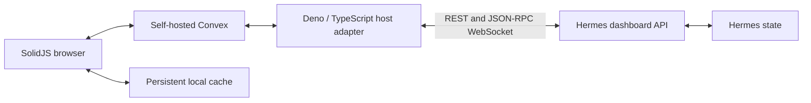

# Hermes integration map

Read when implementing the Hermes adapter, Convex data layer, device access,
reconnect handling, or host deployment. This is a source audit and implementation
contract, not a claim that Arura is implemented or that live integration tests pass.
Product inclusion/exclusion is defined once in [product scope](product-scope.md).
The selected stack remains [ADR-0001](adr/0001-independent-solid-convex-client.md).

## Evidence baseline

Audited on 2026-09-13:

| Source                                                                                                                 | Revision and relevance                                                                                                                                                                          |
| ---------------------------------------------------------------------------------------------------------------------- | ----------------------------------------------------------------------------------------------------------------------------------------------------------------------------------------------- |
| [Hermes](https://github.com/NousResearch/hermes-agent/tree/ee4452991d17534aa561f31ee55596d082aa94e7)                   | `ee4452991d17534aa561f31ee55596d082aa94e7`; both upstream main at lookup and the Hermes revision in the inspected nc lockfile.                                                                  |
| [Existing web client](https://github.com/u-k-g/hermes-agent-desktop-web/tree/655b22ca635218304ccbb331f8e0a1084b9461bb) | `655b22ca635218304ccbb331f8e0a1084b9461bb`; local reference HEAD and nc's pinned web input. Older vendored desktop is reference, not the current backend contract.                              |
| [nc](https://github.com/u-k-g/nc/tree/c70f93faab21ccad5edd9e8b078893f77d2f8f9d)                                        | `c70f93faab21ccad5edd9e8b078893f77d2f8f9d`; inspected lockfile, Hermes module, and web package had no working-copy changes. Declared configuration, not proof of the running system generation. |
| [Macro](https://github.com/macro-inc/macro/tree/e00d041ac7541f773c6119b0183e7868c0130de8)                              | `e00d041ac7541f773c6119b0183e7868c0130de8`; inspected dependencies and sync entry points only, not a performance or whole-codebase review.                                                      |

The audit fetched selected upstream source and inspected local reference code.
It did not read user conversations, API keys, passwords, or live configuration,
invoke agent work, change Hermes/nc, or deploy anything. Endpoint existence was
checked in source, not by sending requests to the live service.

## First-slice interface map

Here, **stored session key** identifies durable conversation data; **runtime
session ID** identifies an attached live agent. They are different. Key Arura's
references by installation, profile, and stored key; hold runtime IDs and replay
epochs separately. Resume may resolve a compression descendant and return a new
runtime ID. Do not make a WebSocket runtime ID the durable Convex conversation key.
[Session lifecycle source][sessions-rpc] and [shared wire types][events] establish
these identities and the resume response.

| Workflow                         | Existing Hermes interface                                                                                                                                      | Arura integration requirement                                                                                                                                                                                                                                      |
| -------------------------------- | -------------------------------------------------------------------------------------------------------------------------------------------------------------- | ------------------------------------------------------------------------------------------------------------------------------------------------------------------------------------------------------------------------------------------------------------------ |
| Connect / detect capabilities    | Authenticated JSON-RPC over `/api/ws`; `gateway.ready` advertises `change_events`, `heartbeat`, `replay_epoch`.                                                | A host adapter owns the connection and negotiates actual capabilities. `/api/events` is a separate PTY channel fanout, not a global durable event feed. [Transport][ws] / [routes][chat-routes].                                                                   |
| List conversations               | `GET /api/sessions` with `profile`, `limit`, `offset`, `archived`, `order`; cross-profile `GET /api/profiles/sessions` and `/api/profiles/sessions/sidebar`.   | Use bounded pages, stable profile scope, and include archived source data as required by Arura's own navigation. Do not confuse source filters with new product sections. [Sessions][sessions-rest] / [profiles][profiles-rest].                                   |
| Read history                     | `GET /api/sessions/{id}/messages?profile=…&limit=…&offset=…&order=latest`; source caps pages at 500; response includes `pagination` and resolved `session_id`. | Cache latest pages, load earlier pages on demand, honor `display_content`/`display_kind`, and resolve compression descendants. Page offsets are not a change cursor. [Sessions][sessions-rest].                                                                    |
| Create / attach                  | `session.create`, `session.resume`; resume can return `session_id`, `session_key`, `running`, `inflight`, `messages`, and hydration information.               | Read-only browsing should use REST rather than eagerly resuming every chat. Attach on need; resume can construct an agent or auto-continue eligible interrupted work. [Session methods][sessions-rpc].                                                             |
| Send                             | `prompt.submit` with runtime `session_id` and `text`, returning an acknowledgement such as `status: streaming`.                                                | Completion comes from events, not the RPC acknowledgement. Persist a web command before dispatch; do not retry an uncertain external send blindly. [Prompt methods][prompt].                                                                                       |
| Stream / finish                  | `message.delta`, `message.interim`, `message.complete`, `session.info`, `error`, tool and input events.                                                        | Normalize an allowlisted display model and batch updates into Convex. Finalize from terminal events, then reconcile persisted history. Honor partial/error/interrupted outcomes and `response_previewed` to avoid duplicates. [Wire types][events].                |
| Stop / steer / queue             | `session.interrupt`, prompt queue/busy handling, and active correction methods.                                                                                | Serialize Arura dispatch for a conversation and model accepted, queued, running, and finished separately. Exact queue editing/reorder and steering behavior needs fixture tests before exposing those controls. [Session methods][sessions-rpc], [prompt][prompt]. |
| Edit / branch                    | `prompt.submit` has explicit confirmed truncation parameters and stable row-ID checks; `session.branch` exists.                                                | Editing is an explicit destructive conversation operation, never an ordinary-send flag carried accidentally. Invalidate affected cached pages; no file rollback UI. [Prompt][prompt] / [sessions][sessions-rpc].                                                   |
| Rename / source flags            | `PATCH /api/sessions/{id}` with title and/or archived, hidden, pinned, unread flags; profile is in the body.                                                   | Rename writes through to Hermes. Web organization remains separate; decide source-flag mirroring explicitly. Title validation can reject a change. [Sessions][sessions-rest].                                                                                      |
| Replay                           | `session.events.since({session_id, last_seen})` returns events, `latest_seq`, `truncated`, `epoch`.                                                            | Replay/deduplicate within an epoch; refetch snapshot/history when truncated or epoch changes. Never promise indefinite replay. [Replay][replay] / [RPC][sessions-rpc].                                                                                             |
| Activity elsewhere               | `sessions.changed` invalidates the session view; watcher observes profile database/WAL changes.                                                                | Refresh affected source data, with a periodic reconciliation backstop. This is not a per-row CDC feed and does not supply every external token stream. [Watcher][watcher].                                                                                         |
| Approvals / questions            | `approval.pending`, `approval.received`, `approval.respond`, `clarify.respond`; request events carry interaction data.                                         | First authorized answer wins in Arura; resolve the upstream request, reconcile stale/already-answered results, and close the prompt on every device. [Prompt methods][prompt].                                                                                     |
| Device access / cached reopening | No reusable Arura device registry or persistent browser cache supplied by these Hermes endpoints.                                                              | Implement with Convex, browser storage, and host authentication; do not expose Hermes credentials to devices as their Arura session.                                                                                                                               |

### Verified limits that change implementation

1. **Replay is in-memory and bounded.** The audited implementation limits a
   session to 512 events and 4 MiB, with 64 sessions and 64 MiB process-wide limits.
   A restart changes the epoch. Buffer eviction and external-process updates
   require snapshot reconciliation. [Replay source][replay].
2. **External changes are not instantaneous token replication.** The watcher
   checks session database signatures on a 0.5-second interval and applies a
   two-second broadcast floor. Connected Arura-originated streams can be pushed
   promptly, but outside-process durable updates inherit that notification delay
   plus reconciliation. Do not promise subsecond propagation for every source.
   [Change watcher][watcher].
3. **No durable prompt idempotency key was verified.** The inspected
   `prompt.submit` handler accepts and launches work without a durable client
   command-key deduplication contract. A JSON-RPC request ID is correlation, not
   proof of exactly-once side effects. A crash between Hermes accepting a send and
   the adapter recording the acknowledgement creates an uncertain outcome.
   Reconcile it; if still ambiguous, mark it unknown and require explicit resend.
   Identical text is not sufficient proof of duplication. [Prompt source][prompt].
4. **Reasoning can arrive in more than one shape.** Filter `reasoning.delta`,
   `reasoning.available`, `thinking.delta`, `subagent.thinking`, and reasoning
   fields embedded in completion/history payloads before browser-facing storage
   or delivery. Hiding an expandable component is insufficient. [Event types][events].
5. **A Hermes login is not a device authorization boundary.** Shared-session
   transport membership intentionally permits another authenticated login to
   attach and logs differing creator identities rather than enforcing ownership.
   Keep the backend private and enforce Arura authorization at every exposed
   boundary. [Transport membership][membership].

## Recommended shape for the first slice

This section specifies the proposed implementation boundary to test next, not an
additional engine selection or a deployed architecture.

The host adapter maintains the long-lived Hermes connection, validates commands,
projects retained data, and handles reconnect. Convex stores web state, command
status, and the browser-facing Hermes read model; it pushes reactive query updates
to devices. Use bounded Convex calls from the adapter. Convex actions have a
documented ten-minute limit and do not automatically retry external side effects,
so they are not an appropriate permanent WebSocket listener. [Action lifecycle](https://docs.convex.dev/functions/actions).

| Data                                                        | Owner / access pattern                                                                                                                               |
| ----------------------------------------------------------- | ---------------------------------------------------------------------------------------------------------------------------------------------------- |
| Source sessions/messages/configuration                      | Hermes authoritative; read model in Convex is rebuildable and scoped by profile.                                                                     |
| Runtime mapping, replay watermark, active activity          | Adapter tracks source identity/epoch; browser-facing projection in Convex; repair from Hermes after gaps.                                            |
| Essentials, folders, ordering, navigation archive timestamp | Arura-owned Convex records; ordered section queries and archived pages of ten.                                                                       |
| Devices / sessions                                          | Arura records; authenticated identity maps to a revocable session and user, not a caller-supplied device label.                                      |
| Command records                                             | Arura records with unique client command ID, dispatch state, outcome, and source correlation; only trusted adapter credentials can report execution. |
| Cached pages, drafts, navigation                            | Browser storage scoped to installation/account; defaults on; clear on logout/revocation learned by the device. Not the server authority.             |
| Files                                                       | Hermes host remains owner; serve authorized downloads and explicit edits; do not copy all attachments into Convex by default.                        |

Start with one adapter dispatcher per installation, a durable command record,
and per-conversation ordering. Do not launch another Hermes agent runtime for
every browser. If the adapter restarts, inspect outstanding dispatches before
claiming new work; transaction-level deduplication inside Convex cannot make the
separate Hermes call atomic. Keep raw replay data and secrets out of ordinary
content caches. Cache refresh must handle edits, deletions, and compaction, not
only append new messages.

### Archive policy boundary

Hermes already supports source pinned/archive flags and an optional runtime sweep.
Its helper defaults to three idle days when enabled and unspecified; source pins
exempt compression lineages. Listing sessions can invoke the config-gated sweep.
We have not read the user's live setting and must not claim it is enabled.
[Sweep configuration][autoarchive] / [source flags][state-sessions].

Recommended first implementation: Arura owns its navigation archive and pin/folder
policy, reads Hermes with source archives included, and keeps source flags separate.
This preserves the seven-day rule and unarchive reset without silently editing
Hermes settings or letting a source sweep hide Arura's pinned folders. Preserve
source archive metadata for inspection/reconciliation; do not interpret source
archiving as deletion. Bidirectional mirroring of source pins/archives would need
an explicit conflict policy and is not assumed by the first slice. This boundary
does not stop rename/message/run changes from updating across clients.

### Device authorization and browser storage

Choose a host-local login/bootstrap mechanism during scaffold implementation;
no hosted identity provider is required. Convex supports [custom JWT providers](https://docs.convex.dev/auth/advanced/custom-jwt).
Authentication is not enough: every query/mutation must also read and validate
the current device/session record. Action/file endpoints and adapter command
dispatch must check authorization too. [Function auth](https://docs.convex.dev/auth/functions-auth).

Revoking a device must invalidate its query access and deny future commands,
downloads, and token renewal even if its current token has not expired. Query
dependencies on the session record should propagate revocation; test this against
an already-open subscription, not only a new login. Verify transport shutdown
behavior separately; a cooperating client closing itself is not enforcement.
Arura identity/session credentials are distinct from host-to-Hermes credentials.

Service-worker asset caching and persistent content/draft storage are separate
from Convex's reactive cache. First paint should use cached, account-scoped data;
reconnect should validate and refresh the subscribed pages. Offline reads/drafts
are required; automatic offline agent-command replay is not assumed. Test storage
eviction, account changes, schema upgrades, and reasoning/secret filtering.

## Remaining retained surfaces: source coverage

These are implementation leads, not a claim that every endpoint has been tested
or that all desktop behavior can be reproduced with a single REST call.

| Product family                                        | Existing source surface / remaining adaptation                                                                                                                                                                                                                                                                                 |
| ----------------------------------------------------- | ------------------------------------------------------------------------------------------------------------------------------------------------------------------------------------------------------------------------------------------------------------------------------------------------------------------------------ |
| Attachments, host browser, editor, generated files    | [File routes][files]: `/api/files*`, `/api/fs/list`, `/api/fs/read-text`, `/api/fs/write-text`, `/api/fs/download`, upload routes. [Prompt attachments][prompt]: `image.attach_bytes`, `pdf.attach`, `file.attach`. Distinguish host-path references from device uploads; cross-conversation file indexing remains Arura work. |
| Search/export/delete                                  | [Session routes][sessions-rest]: search, export, delete, bulk-delete. Preserve pagination and explicit destructive actions.                                                                                                                                                                                                    |
| Slash commands / skills / suggestions                 | [Gateway facade][gateway] and [installed-skill routes][skills]. Use command catalog/completion, not host clipboard or a Skills Hub screen. Contextual suggestion triggers still need desktop-component inspection.                                                                                                             |
| Simple profiles/bots and delegated work               | [Profiles REST][profiles-rest], [profile RPCs][profiles-rpc], [subagents][subagents]. Subagent listing/tail is live and transport-scoped; not a durable delegated-work archive. Basic bot roster/avatar/organization is web UI work.                                                                                           |
| Goals, loops, heartbeats                              | [Session control methods][controls]; map the specific payload variants and failure behavior before implementation. Do not create a second scheduler in the UI.                                                                                                                                                                 |
| Scheduled jobs / blueprints                           | [Cron routes][cron]; job CRUD, pause/resume/trigger, run history, delivery targets, templates. Existing messaging gateway owns ticking.                                                                                                                                                                                        |
| Webhooks, messaging and messaging-user access         | [Ops][ops] and [messaging][messaging]; `/api/webhooks*`, `/api/pairing*`, platform config/onboarding. These pairing records are not browser-device authorization.                                                                                                                                                              |
| Memory / graph / curator                              | [Memory providers][memory], [ops][ops], [status][status]; runtime settings may disable memory on this host. Do not change them just because the UI supports them.                                                                                                                                                              |
| Toolsets / MCP / connectors / agent plugins           | [Tools][tools], [MCP][mcp], [desktop plugin API][plugins], [gateway registry][gateway]. Distinguish agent capabilities from excluded UI plugins, vaults, and browser panels. Connector/plugin details require feature-specific validation.                                                                                     |
| Model/provider/keys, fallbacks, auxiliary models, MoA | [Models][models], [configuration][config]; preserve runtime defaults/profile scope. Do not expose API keys in general queries or cache them with settings data.                                                                                                                                                                |
| Usage / context / technical status / logs             | [Analytics][analytics], [status][status], `session.usage` and `session.context_breakdown` in [session RPCs][sessions-rpc]. Estimated cost is not an authoritative provider bill.                                                                                                                                               |
| Restart / update                                      | [Actions][actions] call upstream management paths; nc is declarative. Implement host-configured operation IDs with separate status reporting rather than hard-coding upstream updater calls.                                                                                                                                   |
| Backup / local diagnostics                            | [Ops][ops] has backup creation/download. [Status][status] `/api/ops/debug-share` invokes upload-based sharing: do not reuse it for local diagnostics. Local report assembly and web-state backup/restore coverage are adapter work.                                                                                            |
| Advanced settings / warm backends                     | [Configuration][config] and [desktop settings API][desktop-config]. Respect managed values and report unsupported fields instead of pretending writes succeeded.                                                                                                                                                               |
| Palette / shortcuts / notifications                   | Implement in Solid using retained actions. In-app events need no external push provider.                                                                                                                                                                                                                                       |

## Existing web port and Macro: what to reuse as reference

The existing [REST bridge][old-rest] captures profile routing, proxy error handling,
credentials, and WebSocket URL issues. Its browser-local connection registry and
same-tab callbacks are not cross-device state or device authorization. Do not copy
its Electron-shaped capability adapter as Arura's app model. Its [download adapter][old-download]
is useful for filename/fallback behavior; normal browser downloads do not expose
an arbitrary local destination path.

Macro's [web dependencies][macro-package] confirm Solid Router, Solid Query, and
Solid Virtual. Study list virtualization, focus, and component boundaries as each
screen is built; do not adopt its complete workspace or add Solid Query as a second
owner of Convex-managed state by default. Its [query sync provider][macro-provider]
invalidates application queries, while its [document sync service][macro-sync]
uses Loro/Cloudflare Durable Objects. Neither replaces the selected Convex layer.

## Hosting seam

The inspected [nc module][nc-module] declares four relevant system services:

- `hermes`: dashboard API, loopback port 9119 by default, basic-auth credentials
  generated at service startup and kept out of the Nix store.
- `hermes-gateway`: messaging/cron runtime, not an interchangeable name for the
  dashboard API. Preserve its single-instance lifecycle.
- `hermes-web`: existing Deno proxy/static UI, loopback port 9120 by default;
  narrow filesystem/network access plus Host/Origin checks.
- `hermes-serve`: Tailscale HTTPS forwarding, port 8443 by default, with a scoped
  listener lifecycle that avoids resetting other applications' Serve configuration.

The [web package][nc-package] builds the pinned reference UI and installs its
static output/proxy. Arura needs its own package/service wiring; it is not a
drop-in `webDist` change. Preserve origin validation and private backend access,
provide persistent Convex state, host adapter credentials, and independent service
lifecycles. Put the development deployment beside the existing one with separate
state/listener configuration. No nc edits or port allocation were made in this audit.

Managed machine wiring is separate from runtime model/provider configuration in
the module. It still enables capabilities omitted from Arura (for example wake
word/browser/terminal tools); those are not errors to fix during this UI project.

## Evidence required before declaring the first slice complete

- Two authorized browsers receive the same normalized reply/activity and rename;
  opening one conversation does not navigate the other browser.
- Adapter disconnect/restart, event-buffer overflow, and source restart recover
  without duplicate display or automatic duplicate prompt dispatch. Ambiguous
  external sends remain visibly unresolved until reconciled.
- Changes from another Hermes surface appear with measured latency; no claim that
  the watcher exposes every external token stream.
- Essentials/folders remain reachable, archive paging is ten at a time, and
  unarchive resets inactivity without modifying runtime auto-archive settings.
- Mobile cold/repeat loads are measured separately; cached history/drafts reopen
  while disconnected; large transcripts page without loading the whole history.
- Revocation denies new data/actions on existing connections; reasoning and
  secrets never enter browser-facing content storage.
- Normal and failed/interrupted turns, simultaneous input responses, edits, and
  compression descendants are exercised against the pinned backend.

The implementation now uses individually revocable browser cookies, short-lived
RS256 Convex tokens, serialized 150 ms turn batches, IndexedDB conversation/draft
caching, and atomic command claims. The isolated integration suite exercises
two-device reactive updates, archive/restore, offline reopening, storage failure,
revocation, command idempotency, replay ordering, and restarted-gateway recovery.
Its gateway fixture follows the audited contracts but is not the real Hermes
runtime. See [Development](development.md) for the reproducible command.

Still requiring live validation: profile ownership during concurrent desktop/CLI
use, replay-window overflow while a run is active, compressed-session lineage,
provider-specific settings, all retained administration flows, and physical phone
performance. Reattaching after a gateway restart restores public inflight content;
it does not promise recovery of every historical tool event beyond Hermes's replay
window. Deployment into the host configuration has not been performed.

[sessions-rest]: https://github.com/NousResearch/hermes-agent/blob/ee4452991d17534aa561f31ee55596d082aa94e7/hermes_cli/web_routers/sessions.py
[profiles-rest]: https://github.com/NousResearch/hermes-agent/blob/ee4452991d17534aa561f31ee55596d082aa94e7/hermes_cli/web_routers/profiles.py
[sessions-rpc]: https://github.com/NousResearch/hermes-agent/blob/ee4452991d17534aa561f31ee55596d082aa94e7/tui_gateway/methods_session.py
[prompt]: https://github.com/NousResearch/hermes-agent/blob/ee4452991d17534aa561f31ee55596d082aa94e7/tui_gateway/methods_prompt.py
[events]: https://github.com/NousResearch/hermes-agent/blob/ee4452991d17534aa561f31ee55596d082aa94e7/apps/shared/src/gateway-events.ts
[ws]: https://github.com/NousResearch/hermes-agent/blob/ee4452991d17534aa561f31ee55596d082aa94e7/tui_gateway/ws.py
[chat-routes]: https://github.com/NousResearch/hermes-agent/blob/ee4452991d17534aa561f31ee55596d082aa94e7/hermes_cli/web_routers/chat_ws.py
[replay]: https://github.com/NousResearch/hermes-agent/blob/ee4452991d17534aa561f31ee55596d082aa94e7/tui_gateway/event_replay.py
[watcher]: https://github.com/NousResearch/hermes-agent/blob/ee4452991d17534aa561f31ee55596d082aa94e7/tui_gateway/change_watcher.py
[membership]: https://github.com/NousResearch/hermes-agent/blob/ee4452991d17534aa561f31ee55596d082aa94e7/tui_gateway/session_transports.py
[controls]: https://github.com/NousResearch/hermes-agent/blob/ee4452991d17534aa561f31ee55596d082aa94e7/tui_gateway/methods_session_control.py
[autoarchive]: https://github.com/NousResearch/hermes-agent/blob/ee4452991d17534aa561f31ee55596d082aa94e7/hermes_cli/web_server_sessions.py
[state-sessions]: https://github.com/NousResearch/hermes-agent/blob/ee4452991d17534aa561f31ee55596d082aa94e7/hermes_state_sessions.py
[files]: https://github.com/NousResearch/hermes-agent/blob/ee4452991d17534aa561f31ee55596d082aa94e7/hermes_cli/web_routers/files.py
[gateway]: https://github.com/NousResearch/hermes-agent/blob/ee4452991d17534aa561f31ee55596d082aa94e7/tui_gateway/server.py
[skills]: https://github.com/NousResearch/hermes-agent/blob/ee4452991d17534aa561f31ee55596d082aa94e7/hermes_cli/web_routers/skills.py
[profiles-rpc]: https://github.com/NousResearch/hermes-agent/blob/ee4452991d17534aa561f31ee55596d082aa94e7/tui_gateway/methods_profiles.py
[subagents]: https://github.com/NousResearch/hermes-agent/blob/ee4452991d17534aa561f31ee55596d082aa94e7/tui_gateway/methods_subagents.py
[cron]: https://github.com/NousResearch/hermes-agent/blob/ee4452991d17534aa561f31ee55596d082aa94e7/hermes_cli/web_routers/cron.py
[ops]: https://github.com/NousResearch/hermes-agent/blob/ee4452991d17534aa561f31ee55596d082aa94e7/hermes_cli/web_routers/ops.py
[messaging]: https://github.com/NousResearch/hermes-agent/blob/ee4452991d17534aa561f31ee55596d082aa94e7/hermes_cli/web_routers/messaging.py
[memory]: https://github.com/NousResearch/hermes-agent/blob/ee4452991d17534aa561f31ee55596d082aa94e7/hermes_cli/web_routers/memory_providers.py
[status]: https://github.com/NousResearch/hermes-agent/blob/ee4452991d17534aa561f31ee55596d082aa94e7/hermes_cli/web_routers/status.py
[tools]: https://github.com/NousResearch/hermes-agent/blob/ee4452991d17534aa561f31ee55596d082aa94e7/hermes_cli/web_routers/tools.py
[mcp]: https://github.com/NousResearch/hermes-agent/blob/ee4452991d17534aa561f31ee55596d082aa94e7/hermes_cli/web_routers/mcp.py
[plugins]: https://github.com/NousResearch/hermes-agent/blob/ee4452991d17534aa561f31ee55596d082aa94e7/apps/desktop/src/api/plugins.ts
[models]: https://github.com/NousResearch/hermes-agent/blob/ee4452991d17534aa561f31ee55596d082aa94e7/hermes_cli/web_routers/models.py
[config]: https://github.com/NousResearch/hermes-agent/blob/ee4452991d17534aa561f31ee55596d082aa94e7/hermes_cli/web_routers/config_env.py
[analytics]: https://github.com/NousResearch/hermes-agent/blob/ee4452991d17534aa561f31ee55596d082aa94e7/hermes_cli/web_routers/analytics.py
[actions]: https://github.com/NousResearch/hermes-agent/blob/ee4452991d17534aa561f31ee55596d082aa94e7/hermes_cli/web_routers/actions.py
[desktop-config]: https://github.com/NousResearch/hermes-agent/blob/ee4452991d17534aa561f31ee55596d082aa94e7/apps/desktop/src/api/config.ts
[old-rest]: https://github.com/u-k-g/hermes-agent-desktop-web/blob/655b22ca635218304ccbb331f8e0a1084b9461bb/apps/web/src/bridge/gateway/rest.ts
[old-download]: https://github.com/u-k-g/hermes-agent-desktop-web/blob/655b22ca635218304ccbb331f8e0a1084b9461bb/apps/web/src/bridge/gateway/download.ts
[macro-package]: https://github.com/macro-inc/macro/blob/e00d041ac7541f773c6119b0183e7868c0130de8/apps/web/package.json
[macro-provider]: https://github.com/macro-inc/macro/blob/e00d041ac7541f773c6119b0183e7868c0130de8/apps/web/src/lib/queries/sync/SyncProvider.tsx
[macro-sync]: https://github.com/macro-inc/macro/blob/e00d041ac7541f773c6119b0183e7868c0130de8/services/sync-service/README.md
[nc-module]: https://github.com/u-k-g/nc/blob/c70f93faab21ccad5edd9e8b078893f77d2f8f9d/modules/hermes.mod.nix
[nc-package]: https://github.com/u-k-g/nc/blob/c70f93faab21ccad5edd9e8b078893f77d2f8f9d/packages/hermes-desktop-web.mod.nix

## Implementation validation update

The Deno adapter has completed authenticated read-only checks against the host's
Hermes dashboard: profiles, conversation discovery, schedules, installed skills,
message history, and the authenticated WebSocket handshake. Provider discovery
was required before password login and is now covered by a regression test. No
agent prompt or settings mutation was used for these checks.

The isolated two-browser suite exercises the real self-hosted Convex backend,
conversation streaming, organization, device revocation, offline reopening,
storage-disabled browsers, file editing and selected-line attachment, generated
file indexing, and schedule blueprints. The Nix-built application also passed the
suite with a fresh runtime cache. Fixture coverage does not establish every
retained resource's compatibility with live Hermes.

History projection now serializes page updates per conversation, invalidates
older offset pages when the newest page changes, and rejects older pages fetched
against a stale head. Older-page reads compare the head before and after fetching;
a continuously changing conversation reports a retryable error after three tries.
This handles offset movement without claiming an atomic snapshot API from Hermes.

Outstanding validation includes live sends and settings writes,
long-running mobile performance, and the NixOS
rollout. Advanced retained feature surfaces still need implementation and acceptance
coverage; the product scope is not a completion ledger.

Additional isolated coverage exercises provider device authorization, auxiliary
model cost confirmation, ordered fallback preservation and disabling, MCP OAuth
callback state validation, memory-map editing and local visualization import/export,
and basic bot appearance, uploaded avatars, and canonical hidden-chat selection.
Bot identity follows the profile's canonical `Bot Chat`, rather than whichever
conversation was most recently active. Upstream does not provide a database-level
unique-title guarantee; Arura serializes its own bot-opening commands and adopts
the gateway's resolved canonical session.

File previews flagged as truncated, binary, or containing replacement characters
cannot be saved through the editor. Conversation exports use Arura's versioned
JSON format and contain normalized public messages only, excluding hidden reasoning.
They are readable conversation exports, not Hermes database backups. Search results
likewise omit upstream snippets, whose truncation could expose private reasoning.

Dedicated Settings pages cover delegated-work limits and inference inheritance,
cached-agent lifetime and memory thresholds, and host computer-use readiness and
permission mode. They submit changed fields only and detect overlapping changes
before saving. The source does not offer an atomic configuration compare-and-swap,
so concurrent writes after that check remain an upstream limitation.
Field names and defaults follow [Hermes configuration defaults](https://github.com/NousResearch/hermes-agent/blob/ee4452991d17534aa561f31ee55596d082aa94e7/hermes_cli/config_defaults.py)
and [delegation validation](https://github.com/NousResearch/hermes-agent/blob/ee4452991d17534aa561f31ee55596d082aa94e7/tools/delegate_tool_config.py).

Hermes does not provide an atomic inflight snapshot plus replay cursor. On replay
truncation or attaching to an already running turn, Arura switches to one-second
whole-snapshot refreshes instead of appending deltas to a potentially overlapping
snapshot. The UI labels recovery, and final completion replaces the partial answer.
Intact same-epoch replay continues to deduplicate actual event sequence numbers;
the adapter never advances its cursor directly to the separately sampled
`latest_seq`. Isolated tests cover both gateway restart and truncated replay.

Mixture presets have explicit add/rename/delete controls, reference model rows,
an aggregator, cadence, temperatures, and timeout settings. The audited dedicated
MoA PUT replaces the preset map but silently clears `privacy_filter`; generic
config PUT preserves it but recursively merges maps and cannot delete old names.
Arura uses the dedicated endpoint only when no filter is configured. With an
existing filter, add/edit uses the generic endpoint and rename/delete is disabled.
This preserves host policy without modifying Hermes or replacing its complete raw
configuration. See [MoA routes](https://github.com/NousResearch/hermes-agent/blob/ee4452991d17534aa561f31ee55596d082aa94e7/hermes_cli/web_routers/models.py)
and [configuration merging](https://github.com/NousResearch/hermes-agent/blob/ee4452991d17534aa561f31ee55596d082aa94e7/hermes_cli/config.py).
